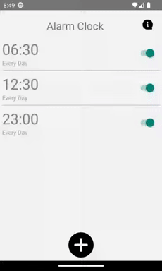
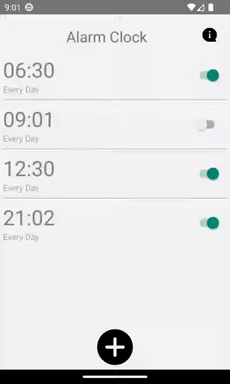
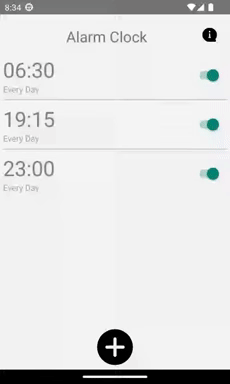
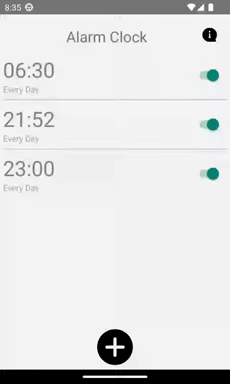
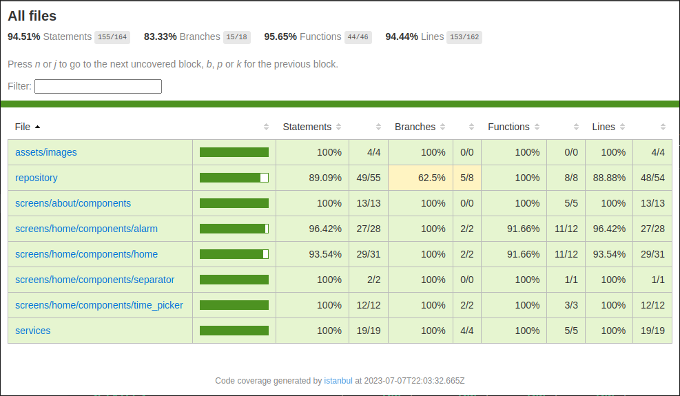

# Good Morning Comfort Alarm Clock

Hey there!

This is the `Comfort Alarm Clock` written in [TypeScript](https://www.typescriptlang.org/) using the framework [ReactNative](https://reactnative.dev/).

The project was created to apply my knowledge in React Native and the best practices in App development.

It was coded using the MVVM (Model-View-ViewModel) design pattern to separate the concerns of the user interface, business logic, and data representation improving the app's quality, maintainability and extensibility.

## building
If by any reason the directory `./android` be removed, follow the script:

1. `$ yarn add -D eject`
2. `$ npx react-native eject`
3. Execute the installation guide of the package `react-native-background-actions` following [this](https://github.com/Rapsssito/react-native-background-actions) instructions.

## running
1. `$ npx react-native start`

## testing
To ensure that the code do what it should do and preventing not breaking anything in the next maintenances, unit and integration tests were implemented in three steps:

1. **snapshot tests** - to ensure that the app is rendering correctly, like the colors and shapes of the components.

2. **user interactions tests** - to ensure that the app behaves correctly when interacted with by a user. 

3. **component tests** - to ensure that the local hooks, services and repositories are working as expected.

To obtain the statistics of the coverage run the follow command:

`$ yarn test --coverage`

And access the path `./coverage/lcov-report/index.html`

See you ! (: